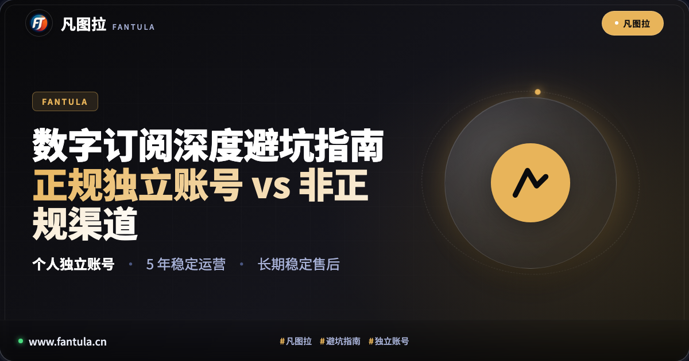
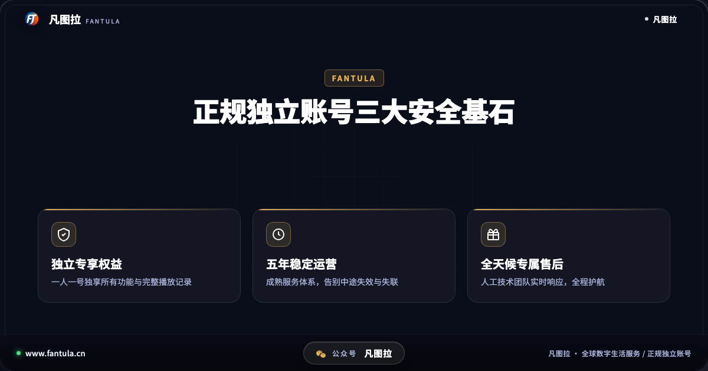
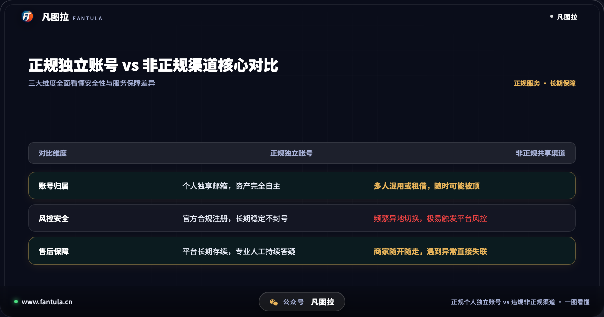
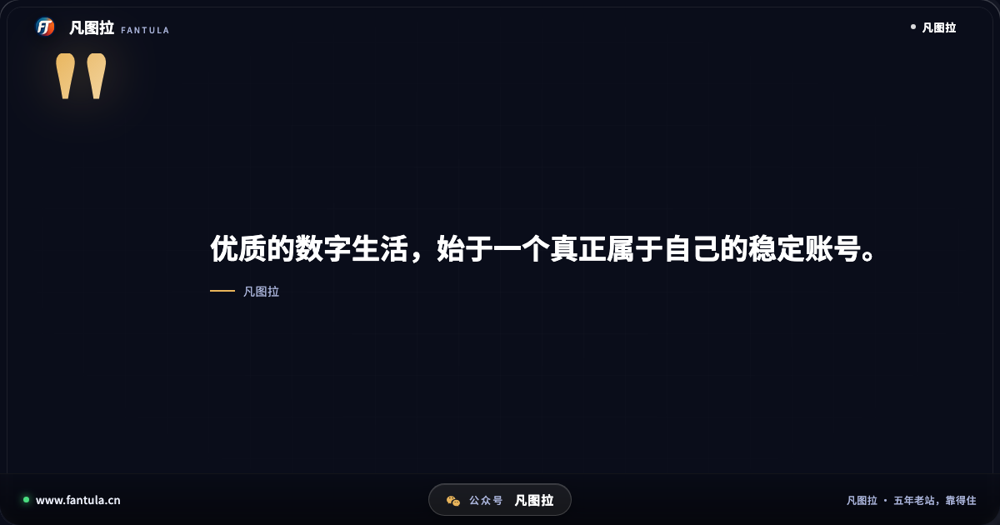
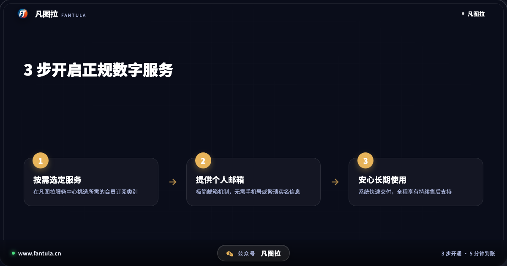

# 别再踩雷！数字订阅正规独立账号 vs 非正规渠道 3 大核心对比

在享受 Spotify、Netflix 等海外流媒体音乐、影视与各类数字会员服务时，你是否也曾遇到过这样的烦恼：刚开通没多久的服务突然无法登录，歌单与播放记录在一夜之间丢失，找当时提供服务的渠道处理，对方却早已音讯全无。根据主流社区与问答平台的真实用户反馈，这类因非正规渠道带来的掉线、封号以及服务中断问题屡见不鲜。数字订阅原本是为了提升日常娱乐与学习品质，却往往因为一个不慎的选择，变成了消耗精力的繁琐拉锯。

为什么同样的流媒体与数字服务，使用体验却会有天壤之别？核心的根源，正在于你所使用的账号形态究竟是「正规个人独立账号」，还是游离于合规边缘的「非正规共享渠道」。

## 一、现状观察：数字订阅背后的隐形暗坑

随着全球数字化生活的深入，优质的内容生态吸引了越来越多的朋友。然而，由于官方支付方式的门槛与不同区域的设置差异，市场上衍生出了形形色色的第三方服务提供方。在缺乏专业鉴别经验的情况下，不少朋友往往只看重表面的开通动作，却忽略了底层机制的巨大差异。

非正规渠道通常采用非官方推荐的临时拼凑手段或多人共用机制。表面上看服务似乎能够正常启用，但在各大平台的风控系统眼里，这类账号存在极其明显的异常行为特征。例如，一个账号在短时间内出现多地并发登录、异常网络环境频繁切换，或者账号绑定的支付凭证属于高风险批量行为。一旦平台的安全风控策略收紧，首当其冲遭遇限制或封停的，正是这类账号。当用户遭遇异常时，这类临时渠道的运营方往往无力提供持续技术支撑，甚至直接选择闭店退场，最终所有的时间成本与数据损失只能由用户自行承担。

## 二、深度拆解：正规独立账号与非正规渠道的 3 大核心差异

要从根本上避免数字订阅踩坑，我们需要拨开营销迷雾，从账号资产、安全机制与服务延续性三个关键维度进行客观审视。

### 1. 账号所有权与资产完整性

使用正规个人独立账号，最首要的保障就是「纯粹的个人专属归属」。服务开通在完全属于你个人的邮箱体系之上，所有的个人隐私、播放列表、算法推荐模型以及收藏内容，均由你独立掌控。你无需担心有其他人同时登录挤占名额，也不用顾虑私人收听记录被他人篡改。

相比之下，非正规渠道常常通过多人混用或临时租借的方式运作。多人同时在线容易引发互踢和播放中断；更严重的是，一旦某一个共同使用者存在违规操作，整个账号的所有数据都会被平台一并清退。个人精心整理数年的音乐收藏与个性化推荐数据，一旦丢失便无法找回。

### 2. 平台风控策略与长期稳定性

全球主流流媒体平台（如 Spotify、YouTube 等）均部署了高度智能的实时风控系统。正规个人独立账号从注册、资料认证到官方渠道履约，全流程均完全符合平台的服务条款（Terms of Service）。在官方合规的体系下，用户的正常使用行为能够被系统准确识别为高信誉度的个人行为，因此具备长期运行的稳定性。

而非正规渠道则常常依赖临时批量操作或非受控环境进行开通。随着各大平台对非常规行为的审核日益严格，这类账号随时面临二次验证甚至永久限制。这也是为什么许多朋友反映自己的服务总是断断续续，无法获得完整而安稳的使用体验。

### 3. 服务存续周期与专业售后保障

衡量一项数字化服务的真实品质，不能只看开通那一刻，更要看后续持续使用时的保障力度。正规平台拥有成熟的品牌沉淀与长期的技术运营体系，无论是在售前咨询、自动化快速交付，还是在后续使用中的疑问解答，都能提供全天候的专业人工支持。

而在非正规渠道的运作模式中，往往没有长效的服务规划，遇到平台政策变动或系统风控时缺乏应对能力，经常出现「开通即失联」的局面。这也是数字订阅领域最让消费者头疼的痛点所在。

## 三、避坑指南：如何挑选真正安心的数字生活服务

了解了底层逻辑后，在面对琳琅满目的数字化订阅服务时，我们应当如何做出理智且明智的选择？建议大家把握以下三个黄金标准：

1. **认准个人独立交付**：坚决远离任何多人混用或临时借用的服务形式。确认服务是完全交付至个人独立账户，确保资产掌控权在自己手中。
2. **考察平台运营周期**：数字化服务拼的是耐力与信誉。优先选择具备多年稳定运营历史、拥有清晰品牌标识与完善服务条款的正规平台，规避新冒头的无资质作坊。
3. **确认售后响应机制**：在选择前先了解其客服响应渠道是否畅通。具备规范售后保障与技术支持团队的平台，才能真正为你的数字生活全程保驾护航。

作为深耕全球数字生活服务领域的成熟平台，凡图拉始终坚持合规与稳定的核心价值。平台自 2019 年稳步发展至今，已拥有超过五年的稳定运营经验，建立了极简邮箱交付机制与全方位的技术售后体系，专注为用户提供正规独立的流媒体与数字会员服务。

数字生活的核心初衷，是让优秀的音乐、影视与知识内容无拘无束地丰富我们的每一天，而不是让我们在频繁的异常排查与重新开通中耗费精力。选择正规合规的个人独立账号，才能让每一次播放都顺畅无忧，让高品质的数字体验真正融入生活。

你在使用数字订阅服务的过程中，是否也曾遭遇过掉线或异常？欢迎在评论区分享你的经历与看法。

---

> 原文：[别再踩雷！数字订阅正规独立账号 vs 非正规渠道 3 大核心对比](https://www.fantula.com/blog/article/digital-subscription-independent-account-vs-unauthorized-channels)
